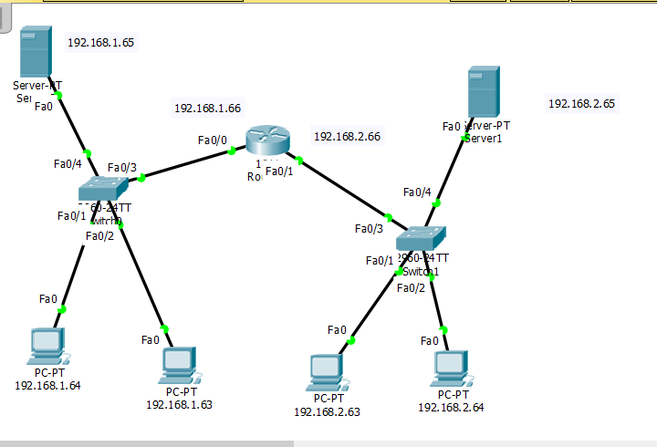
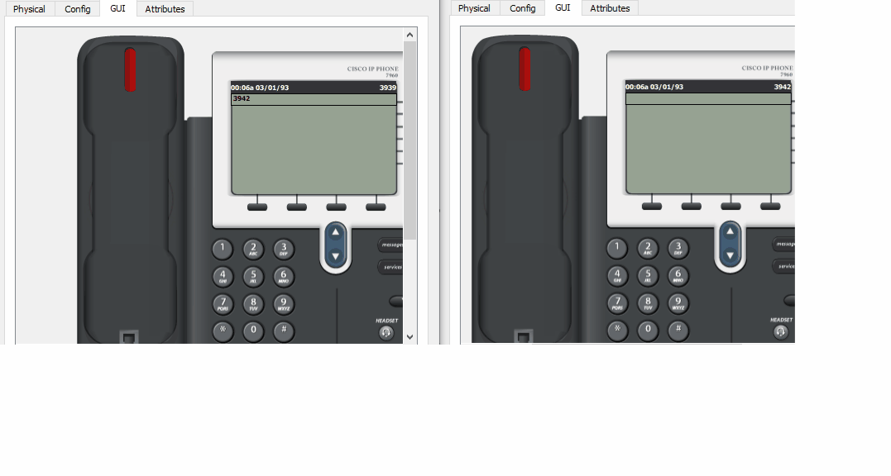
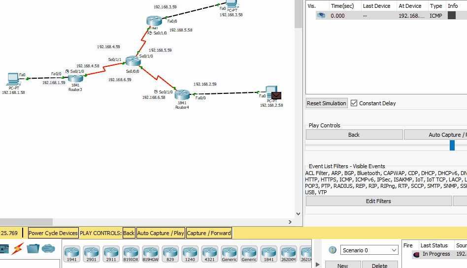
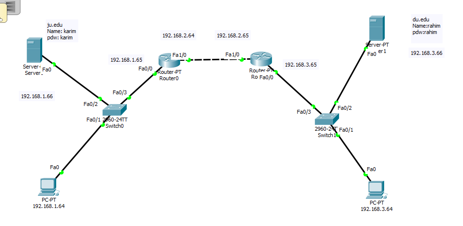

# Computer_Networks
## packet through Hub and Switch
 
## packet through Router
 
## Configuration of Router with CLI
 
## Vlan Configuration with Switch and Router
 
## DNS Server Configuration
 
*Configuration Layout of DNS Server* 

*Example DNS Server 1*   

**Example DNS Server 2**  
## IP Telephony

Configuration Layout | Simulation
------------ | -------------
| 
## Implementation of OSPF Algorithm

*Implementation of OSPF Algorithm*  

## Implementation of Mail Server
 

Mail Server 1 | Mail Server 2
------------ | -------------
 | 
